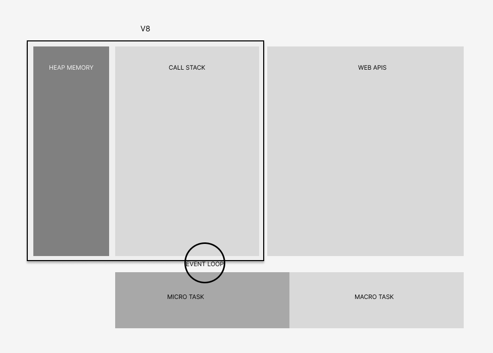

# 7749 CÁCH BẬT NGƯỜI INTERVIEW VỚI JAVASCRIPT

.jpg)

> *Lời nói đầu,* 

*Đây là một trong những series chắt lọc các kiến thức để sẵn sàng chửi nhau và solo cùng với người phỏng vấn, sau khi tiếp nhận thông tin bí kíp ở đây cùng với việc hiểu rõ vấn đề, tôi tin rằng bạn có thể debate 1:1 với người phỏng vấn và xem ai mới là người out trình ở đây. Mọi thông tin viết trên đều là xàm lờ nên người đọc tài liệu vui lòng không thái độ với người phỏng vấn dù đúng hay sai vì điều này sẽ chẳng mang lại lợi ích gì cho chúng ta và chỉ làm cho bạn không có cửa dù là cửa hậu. Trong series này sẽ đem đến những kiến thức tổng quát cho người đọc.*
> 

# **PHẦN CHÍNH BẮT ĐẦU TỪ ĐÂY**

# I. KIỂU DỮ LIỆU (TYPE)

Trong Javascript có 08 kiểu dữ liệu chính được sử dụng trong đó trừ Object là kiểu dữ liệu ***Phức Tạp (Reference Data Type)*** ra thì tất cả các kiểu dữ liệu còn lại đều là kiểu dữ liệu ***Nguyên Thủy (Primitive Data Type)***

- String
- Number
- **Object**
- Null
- Undefined
- Boolean
- Symbol
- BigInt

Trong kiểu **dữ liệu phức tạp (Primitive Data Type)** có 2 subtype chúng ta thường sử dụng phổ biến là: **Function** và **Array**

# II. **UNDECLARED AND UNDEFINED**

Trong 2 keyword này có thể nhận biết rằng Undeclared là chưa được khai báo và Undefined là đã khởi tạo nhưng không có giá trị. Chúng ta có thể thường xuyên gặp các lỗi như dưới đây:

```jsx
var i;
Output: undefined

//or

console.log(a);
function(){
	let a = 5;
}

Output: a is not defined (hay còn gọi là Undeclared)
```

# III. SCOPE

Scope là phạm vi truy cập và hoạt động của một biến. Trong JS, có 3 loại scope là:

- Global scope: là phạm vi hoạt động của biến toàn bộ chương trình.
- Local scope (Function): là phạm vi hoạt động của biến trong 1 hàm.
- Block scope: là phạm vi hoạt động của biến trong 1 block code `{ }` khi khai báo biến bằng let and const.

Việc hoạt động và phạm vi truy cập của scope sẽ là giới hạn được sử dụng từ các biến. Và các biến bên ngoài có thể được truy cập vào bên trong các scope và các biến từ function hay block scope không thể được truy cập ngược từ bên ngoài, hay từ global.

Trong đó khi thực thi một đoạn code, giá trị biến được gọi sẽ được tìm thấy trong scope gần nhất, nếu trong scope đó biến cần tìm không được khai báo lúc này phạm vi sẽ từ nhảy ra scope bên ngoài để tìm kiếm biến đó. Trong trường hợp biến được gọi không được khai báo trước khi biến được khởi tạo, sẽ có lỗi trả ra là ReferencesError và biến is not defined.

# IV. CLOSURE

Closures là Closure là một function kết hợp với các biến bên ngoài và các biến state (lexical environment). Ví dụ dưới đây sẽ làm rõ Closure:

```jsx
const name = 'TuanQC'   //Lexical Environment
function sayHi()
{
		console.log(`Hi ${name} `);
}

sayHi();
```

Như ta thấy thì ${name} ở trong đang truy cập dến lexical environment. Khi này lexical environment được chuyển vào Heap Memory (heap memory sẽ xóa đi khi tab đó, chương trình đó kết thúc) và được xóa khi không có bất kỳ function nào sử dụng đến chúng theo cơ chế Garbage Collector.

Closure có thể sử dụng mang tính đóng gói trong OOP. Các biến được khai báo trong function đó sẽ chỉ được phép truy cập trong phạm vi local scope của chúng và không thể truy cập và sửa từ ngoài nên có thể gọi là Closure mang đặc trưng của Encapsulation trong OOP.

## LEXICAL SCOPE

Lexical Scope là một trong những khai báo phạm vi truy cập của biến trong Javascript. 

Lexical Scope được xác định bởi vị trí của khai báo biến trong code và tính tuyệt đối, nghĩa là chỉ có thể truy cập tới biến được khai báo trong cùng 1 scope và các scope con của nó.

Ví dụ:

```jsx
function a(){
    const x = 10;
    function b(){
        console.log(x);
    }
    b();
}
a();
```

Với Lexical Scope, các biến được khai báo trong function sẽ không thể truy cập tới ngoài function. Tuy nhiên, các function bên trong có thể truy cập đến các biến được khai báo trong function của nó.

# V. NATIVE

Native trong Javascript được hiểu là các hàm và đối tượng được cung cấp sẵn bởi ngôn ngữ. Những hàm và đối tượng này được viết bằng Javascript và có sẵn trong ngôn ngữ, giúp cho việc sử dụng và xử lý các tác vụ trợ giúp cho việc lập trình được dễ dàng hơn. Ví dụ về các built-in objects là **Math**, **Array**, **String**, và các hàm built-in như **alert()**, **setTimeout()**, và **setInterval()**.

Ví dụ:

```jsx
var arr = new Array(1, 2, 3, 4, 5);
console.log(arr.length); // Trả về độ dài của mảng
console.log(arr.push(6)); // Thêm phần tử 6 vào cuối mảng
console.log(arr); // In ra mảng [1, 2, 3, 4, 5, 6]
```

Native sẽ ược sử dụng phổ biến với 3 loại là:

- **Đối tượng Native**: String, Array, Math, Date, …
- **Phương thức Native**: toUpperCase, …
- **Thuộc tính Native**: length, …

# VI. FOREACH / MAP / FILTER / REDUCE

## forEach

`forEach` là một hàm được sử dụng để duyệt qua tất cả các phần tử trong mảng và thực hiện một hành động đối với mỗi phần tử đó. Hàm `forEach` không trả về giá trị, nó chỉ thực hiện một hành động trên tất cả các phần tử của mảng.

Cú pháp:

```jsx
array.forEach(function(currentValue, index, arr), thisValue)

```

**currentValue**: Giá trị của phần tử hiện tại

**index**: Chỉ số của phần tử hiện tại

**arr**: Mảng đang được duyệt

**thisValue** (tùy chọn): Giá trị toán tử this được sử dụng trong hàm

Ví dụ:

```jsx
const numbers = [1, 2, 3, 4, 5];
numbers.forEach(function(number) {
    console.log(number);
});
// Output: 1, 2, 3, 4, 5

```

## map

`map` là một hàm trả về một mảng mới, chứa giá trị được trả về bởi hàm được gọi đối với từng phần tử của mảng.

Cú pháp:

```jsx
array.map(function(currentValue, index, arr), thisValue)

```

**currentValue**: Giá trị của phần tử hiện tại

**index**: Chỉ số của phần tử hiện tại

**arr**: Mảng đang được duyệt

**thisValue** (tùy chọn): Giá trị toán tử this được sử dụng trong hàm

Ví dụ:

```jsx
const numbers = [1, 2, 3, 4, 5];
const doubledNumbers = numbers.map(function(number) {
    return number * 2;
});
console.log(doubledNumbers);
// Output: [2, 4, 6, 8, 10]

```

## filter

`filter` là một hàm trả về một mảng mới, chứa các phần tử thoả mãn điều kiện được xác định trong hàm được gọi đối với từng phần tử của mảng.

Cú pháp:

```jsx
array.filter(function(currentValue, index, arr), thisValue)

```

**currentValue**: Giá trị của phần tử hiện tại

**index**: Chỉ số của phần tử hiện tại

**arr**: Mảng đang được duyệt

**thisValue** (tùy chọn): Giá trị toán tử this được sử dụng trong hàm

Ví dụ:

```jsx
const numbers = [1, 2, 3, 4, 5];
const evenNumbers = numbers.filter(function(number) {
    return number % 2 === 0;
});
console.log(evenNumbers);
// Output: [2, 4]

```

## reduce

`reduce` là một hàm thục hiện việc tính toán một giá trị duy nhất từ các phần tử của mảng.

Cú pháp:

```jsx
array.reduce(function(total, currentValue, currentIndex, arr), initialValue)

```

**total**: Giá trị tích lũy của phép tính

**currentValue**: Giá trị của phần tử hiện tại

**currentIndex**: Chỉ số của phần tử hiện tại

**arr**: Mảng đang được duyệt

**initialValue** (tùy chọn): Giá trị ban đầu của total

Ví dụ:

```jsx
const numbers = [1, 2, 3, 4, 5];
const sum = numbers.reduce(function(total, number) {
    return total + number;
}, 0);
console.log(sum);
// Output: 15
```

## So sánh forEach, map, filter, reduce

### Kết quả trả về

- `forEach` và `map` đều trả về một mảng mới, nhưng `forEach` không thay đổi giá trị của mảng ban đầu, trong khi `map` thay đổi giá trị của mảng ban đầu.
- `filter` trả về một mảng mới chứa các phần tử thỏa mãn điều kiện được xác định trong hàm đó, còn `reduce` trả về một giá trị duy nhất.

### Cách thực hiện

- `forEach` duyệt qua từng phần tử của mảng và thực hiện một hành động với mỗi phần tử đó.
- `map` duyệt qua từng phần tử của mảng và trả về một giá trị mới cho mỗi phần tử đó.
- `filter` duyệt qua từng phần tử của mảng và trả về một mảng mới chứa các phần tử thỏa mãn điều kiện được xác định trong hàm đó.
- `reduce` duyệt qua từng phần tử của mảng và tích lũy kết quả của từng phần tử để trả về một giá trị duy nhất.

# VII. THIS

## “this” đứng trong một phương thức

Từ khóa this sẽ đề cập tới đối tượng mà nó đang thuộc về. Và this trong hàm tạo sẽ là đại diện tới đối tượng nó được tạo.

```jsx
const iPhone7 = {
    //Properties
    name: 'iPhone 7',
    color: 'black',
    weigth: 137,

    //Methods
    turnOn: function() {
        console.log(this);
    }
}

console.log(iPhone7.turnOn());
```

Một ví dụ khác:

```jsx
const iPhone7 = {
    //Properties
    name: 'iPhone 7',
    color: 'black',
    weight: 137,

    //Methods
    objectChild: {
      methodChild(){
        console.log(this);
      }  
    }
}

console.log(iPhone7.objectChild.methodChild());
```

> **Đặc tính**
**1.** *Trong một phương thức, this tham chiếu tới đối tượng truy cập phương thức (đối tượng trước dấu .)*
**2.** *Đứng ngoài phương thức, this tham chiếu tới đói tượng global*
> 

> ***Lưu ý: Khi một thuộc tính = một hàm (function) thì người ta sẽ định nghĩa nó là một phương thức.**
> 

Ví dụ luyện tập:

```jsx
function car(name, color, weight) {
    this.name = name;
    this.color = color;
    this.weight = weight;
    this.run = function () {
        console.log(this.name + " is running");
    }
}

var car = new car("BMW", "black", 2000);
car.run();
```

## “this” đứng ngoài phương thức

- this không được định nghĩa hay nằm trong function nào sẽ luôn trỏ tới window.
- Khi this được khai báo trong một function vẫn sẽ được trỏ tới window khi nó không thuộc bất kỳ thuộc tính nào.
- Nhưng nếu 'use strict' thì this lúc này sẽ có giá trị là undefined

## “this” với arrow function

Vì arrow function không có this nên this trong arrow function sẽ có cùng context với đối tượng của nó, ví dụ:

```jsx
function Car(name, color) {
  this.name = name;
  this.color = color;
}

Car.prototype.start = function() {
    const test = () => {
        console.log(this.name + ' is starting');
    }
    test();
}

const car = new Car('BMW', 'red');
car.start(); // BMW is starting
```

Nhưng nếu như không phải arrow function mà this lại nằm trong function thì khi này this sẽ luôn trỏ tới window.

## Function.bind()

Phương thức **bind()** sẽ trả về một hàm mới với **this** mới.

Ví dụ:

```jsx
function sayName() {
    console.log('My name is: ' + this.name);
}

const user1 = { name: 'John' };
const user2 = { name: 'Alex' };

const sayHelloToJohn = sayName.bind(user1);
const sayHelloToAlex = sayName.bind(user2);

sayHelloToJohn(); // My name is: John
sayHelloToAlex(); // My name is: Alex

```

Trong ví dụ trên, chúng ta khởi tạo hai đối tượng user1 và user2 với thuộc tính **name** là **John** và **Alex**. Sau đó, chúng ta tạo ra hai hàm mới **sayHelloToJohn** và **sayHelloToAlex** bằng cách sử dụng phương thức **bind()** và truyền vào đối tượng tương ứng làm **this** mới của hai hàm. Sau đó, chúng ta gọi hai hàm mới **sayHelloToJohn** và **sayHelloToAlex** để in ra màn hình câu chào tới **John** và **Alex**.

**Tóm lại:** *Khi muốn trỏ this tới một đối tượng khác thì dùng bind để ép this thuộc một đối tượng đó, khi này this sẽ trả về một hàm mới với this mới.*

## Function.call()

`call()` là một trong những phương thức được cung cấp bởi hầu hết các hàm trong JavaScript. Phương thức này cho phép gọi một hàm và thiết lập context của nó (this) cho một đối tượng khác. Ví dụ, để gọi một hàm `sayHello()` với đối tượng là `user`:

```jsx
function sayHello() {
  console.log(`Hello, ${this.name}!`);
}

const user = { name: 'John' };

sayHello.call(user); // Output: Hello, John!

```

Trong ví dụ trên, chúng ta đã sử dụng phương thức `call()` để gọi hàm `sayHello()` với đối tượng `user` được thiết lập làm context của nó. Khi đó, chúng ta có thể sử dụng thuộc tính `name` của đối tượng `user` để in ra chuỗi `Hello, John!`.

Ngoài ra, phương thức `call()` còn cho phép truyền vào hàm các tham số thông qua các đối tượng.

Ví dụ:

```jsx
function sayHello(age) {
  console.log(`Hello, ${this.name}! You are ${age} years old.`);
}

const user = { name: 'John' };

sayHello.call(user, 30); // Output: Hello, John! You are 30 years old.

```

Trong ví dụ trên, chúng ta đã truyền tham số `30` vào hàm `sayHello()` thông qua phương thức `call()`. Khi đó, chúng ta có thể sử dụng thuộc tính `name` của đối tượng `user` để in ra chuỗi `Hello, John! You are 30 years old.`.

**Tóm lại**: *Phương thức `call()` cho phép gọi một hàm và thiết lập context của nó (this) cho một đối tượng khác. Chúng ta có thể truyền vào hàm các tham số thông qua các đối tượng.*

## Function.apply()

`apply()` là một trong những phương thức được cung cấp bởi hầu hết các hàm trong JavaScript. Phương thức này cho phép gọi một hàm và thiết lập context của nó (this) cho một đối tượng khác. Ví dụ, để gọi một hàm `sayHello()` với đối tượng là `user`:

```
function sayHello() {
  console.log(`Xin chào, ${this.name}!`);
}

const user = { name: 'John' };

sayHello.apply(user); // Output: Xin chào, John!

```

Trong ví dụ trên, chúng ta đã sử dụng phương thức `apply()` để gọi hàm `sayHello()` với đối tượng `user` được thiết lập làm context của nó. Khi đó, chúng ta có thể sử dụng thuộc tính `name` của đối tượng `user` để in ra chuỗi `Xin chào, John!`.

Ngoài ra, phương thức `apply()` còn cho phép truyền vào hàm các tham số thông qua các đối tượng.

Ví dụ:

```jsx
function sayHello(age) {
  console.log(`Xin chào, ${this.name}! Bạn ${age} tuổi.`);
}

const user = { name: 'John' };

sayHello.apply(user, [30]); // Output: Xin chào, John! Bạn 30 tuổi.

```

Trong ví dụ trên, chúng ta đã truyền tham số `30` vào hàm `sayHello()` thông qua phương thức `apply()`. Khi đó, chúng ta có thể sử dụng thuộc tính `name` của đối tượng `user` để in ra chuỗi `Xin chào, John! Bạn 30 tuổi.`.

`apply()` giống với `call()`, nhưng cho phép truyền vào hàm một mảng các tham số thay vì truyền từng tham số một. Ví dụ:

```jsx
function sayHello(age, gender) {
  console.log(`Xin chào, ${this.name}! Bạn ${age} tuổi và là ${gender}.`);
}

const user = { name: 'John' };

sayHello.apply(user, [30, 'nam']); // Output: Xin chào, John!
```

# VIII. HOISTING

Trong JS var, let và const đều được hoisting nhưng giá trị trả về đều được set với các kết quả khác nhau. Ví dụ với var khi hoisting var sẽ được viết lại bằng cách biến var sẽ khởi tạo ngay trên đầu của scope mà biến var khai báo.

```jsx
console.log(a)
var a = 5;
```

Khi khai báo như đoạn code trên, var sẽ được viết lại bằng cách sau:

```jsx
var a
console.log(a)
a = 5
```

Và kết quả khi trả về sẽ là undefined

Nhưng với `const` và `let` sẽ những trường hợp khác, cả const và let đều có hoisting nhưng với quy tắc mà nó có thì **`let sẽ không thể truy cập được biến trước khi khởi tạo`**, và `**const sẽ không thể truy cập được biến trước khi khởi tạo và không thể gán lại giá trị cho biến đó**`.

```jsx
console.log(a)
let a = 5;

console.log(b)
const b = 5
```

Nếu cố tình ghi như này hệ thống sẽ báo ra dòng lỗi là: `**ReferenceError: Cannot access 'a' before initialization**`

# IX. APIs

Để get data từ API chúng ta có 2 cách để thực hiện là dùng XHR hoặc Fetch để lấy dữ liệu về. Trong đoạn dưới đây tôi sẽ nói rõ hơn về cách sử dụng XHR và Fetch và so sánh cách dùng của 2 loại.

## XHR

Với XHR chúng ta sử dụng Object có tên `XMLHttpRequest()`

```jsx
//Để tạo XHR chúng ta sẽ tạo request để lấy yêu cầu từ XMLHttpRequest()
const request = new XMLHttpRequest()
```

Trong XHR, để tạo và cấu hình một yêu cầu HTTP, chúng ta sử dụng phương thức **`open()`**. Phương thức này có các tham số để chỉ định phương thức HTTP (ví dụ: GET, POST), URL của tài nguyên cần truy cập và xác định liệu có yêu cầu bất đồng bộ hay không. Ví dụ:

```jsx
request.open("GET", "url_apis")
```

Và sau đó để gửi lệnh request chúng ta sẽ sử dụng `request.sent()`;

Để hoàn thiện hơn chúng ta sẽ tạo ra một function để có thể dễ dàng tái sử dụng lại code hơn

```jsx
url = "https://Link-Api-Here"

function getData(url){
  const request = new XMLHttpRequest();
  request.open('GET', url);
  request.send();
  request.onload = function(){
    console.log(JSON.parse(request.responseText));
  }
}
```

Khi yêu cầu hoàn thành và dữ liệu được trả về, sự kiện **`onload`** được kích hoạt. Trong sự kiện **`onload`**, dữ liệu được trả về là một chuỗi văn bản, và hàm **`JSON.parse()`** được sử dụng để chuyển đổi chuỗi JSON thành đối tượng JavaScript. Sau đó, đối tượng được ghi vào bảng điều khiển console bằng cách sử dụng **`console.log()`**

## Fetch

Fetch là một API mới trong JavaScript giúp thực hiện yêu cầu HTTP một cách đơn giản và mạnh mẽ. Dưới đây là cách sử dụng fetch để thực hiện yêu cầu GET đến một URL cụ thể:

```jsx
var url = "https://example.com/api/data";

fetch(url)
  .then(response => response.json())
  .then(data => {
    console.log(data);
  })
  .catch(error => {
    console.log(error);
  });
```

Trong fetch việc lấy dữ liệu từ server sẽ trở nên dễ  dàng hơn, khi chỉ việc khai báo `fetch(url)` để lấy dữ liệu từ server. Nhưng ở đây fetch sẽ trả về cho chúng ta một Promise. Và việc .then và .catch sẽ được sử dụng tương tự như promise để lấy và xử lý data từ server.

Tại đây trong hàm `.then()`, chúng ta gọi phương thức `response.json()` để chuyển đổi phản hồi thành đối tượng JavaScript. Lưu ý rằng `response.json()` cũng trả về một promise, vì vậy chúng ta tiếp tục sử dụng một `.then()` nữa.

Trong hàm `.then()` thứ hai, chúng ta có được dữ liệu đã được chuyển đổi và có thể xử lý nó theo ý muốn, trong trường hợp này là in dữ liệu ra bảng điều khiển console.

Nếu có lỗi xảy ra trong quá trình yêu cầu, hàm `.catch()` sẽ được gọi và chúng ta có thể xử lý lỗi đó.

# X. CALLBACK

**Callback function** là một hàm được truyền qua đối số cho một hàm khác, và được gọi trở lại ("callback") sau khi hàm bên ngoài thực hiện xong công việc của mình. Callback function được sử dụng trong các tình huống mà chúng ta muốn thực hiện một tác vụ nào đó chỉ sau khi một tác vụ khác hoàn thành xong. 

Ví dụ:

```jsx
let arr = [1,2,3,4,5,6]

function callback(value, index, array){
  console.log("Value " + value + " Index " + index + " Array " + array)
}

arr.forEach(callback)
```

Tức là function callback đã được khởi tạo và được gọi lại sử dụng làm tham số của hàm khác.

# XI. PROMISE

**Promise** (Từ tiếng Anh: Lời hứa) là một đối tượng trong Javascript được sử dụng để thực hiện các tác vụ bất đồng bộ (asynchronous task). Promise được sử dụng để xử lý các tác vụ chạy ngầm hoặc tác vụ tương tác với server, chẳng hạn như truy xuất cơ sở dữ liệu, tải tài nguyên từ mạng hay gửi dữ liệu đến server.

Promise có 2 trạng thái:

- **Pending**: Trạng thái chờ, khi một Promise mới được tạo ra, trạng thái của nó là `pending`, nghĩa là chờ xử lý.
- **Settled**: Trong settled sẽ xác định 2 state là **`Fulfilled`** hoặc **`Rejected`**

Promise có hai phương thức để xử lý kết quả trả về:

- **then()**: Được sử dụng khi Promise được giải quyết thành công (resolved).
- **catch()**: Được sử dụng khi Promise bị từ chối (rejected).

Ví dụ:

```
const myPromise = new Promise((resolve, reject) => {
  if (Math.random() * 100 <= 90) {
    resolve('Thành công!');
  }
  reject(new Error('Thất bại!'));
});

myPromise
  .then(value => console.log(value))
  .catch(error => console.error(error));

```

Trong ví dụ trên, ta tạo ra một Promise mới, nó sẽ trả về giá trị thành công hoặc bị từ chối khác nhau tùy thuộc vào giá trị của số ngẫu nhiên được sinh ra. Sau đó, ta sử dụng phương thức `then()` để xử lý giá trị trả về thành công và `catch()` để xử lý khi Promise bị từ chối.

# XII. OOP

## Class

1. Định nghĩa:
Lớp (Class) là một khái niệm trong lập trình hướng đối tượng (OOP) trong JavaScript, dùng để tạo ra các đối tượng (objects). Nó định nghĩa các thuộc tính (properties) và phương thức (methods) mà các đối tượng sẽ có.
2. Cách sử dụng:
Để sử dụng lớp trong JavaScript, ta sử dụng từ khóa **`class`** để khai báo lớp, và sau đó tạo ra các đối tượng từ lớp đó bằng từ khóa **`new`**.
3. Cách triển khai và cách hoạt động:
- Để triển khai một lớp, ta sử dụng cú pháp sau:

```jsx
javascriptCopy code
class TenLop {
  // Các thuộc tính
  constructor() {
    // Khởi tạo các thuộc tính
  }

  // Các phương thức
  phuongThuc() {
    // Code xử lý
  }
}
```

- Trong phần constructor, ta khởi tạo các thuộc tính của lớp.
- Các phương thức của lớp được khai báo như các hàm bình thường.

Để tạo ra một đối tượng từ lớp, ta sử dụng từ khóa **`new`**:

```jsx
javascriptCopy code
const doiTuong = new TenLop();
doiTuong.phuongThuc();

```

Trong ví dụ trên, **`doiTuong`** là một đối tượng thuộc lớp **`TenLop`**, và ta có thể gọi phương thức **`phuongThuc()`** của đối tượng đó.

1. Ví dụ:

```jsx
javascriptCopy code
class Person {
  constructor(name, age) {
    this.name = name;
    this.age = age;
  }

  sayHello() {
    console.log(`Hello, my name is ${this.name}. I'm ${this.age} years old.`);
  }
}

const person1 = new Person("John", 25);
person1.sayHello();  // Output: Hello, my name is John. I'm 25 years old.
```

Trong ví dụ trên, chúng ta định nghĩa một lớp **`Person`** có hai thuộc tính **`name`** và **`age`**. Phương thức **`sayHello()`** sẽ in ra câu chào với tên và tuổi của đối tượng **`Person`**. Sau đó, ta tạo một đối tượng **`person1`** từ lớp **`Person`** và gọi phương thức **`sayHello()`** của đối tượng đó. Kết quả sẽ là "Hello, my name is John. I'm 25 years old."

## Đóng gói (Encapsulation)

Đóng gói là một nguyên tắc trong lập trình hướng đối tượng (OOP) trong JavaScript, giúp bảo vệ dữ liệu và các phương thức liên quan bằng cách giới hạn quyền truy cập từ bên ngoài. Điều này đảm bảo rằng dữ liệu chỉ được truy cập và thay đổi thông qua các phương thức công khai được cung cấp bởi lớp.

### Cách sử dụng

Để sử dụng đóng gói trong JavaScript, ta sử dụng phạm vi (scope) và các từ khóa như `this`, `private`, và `get/set` để quản lý quyền truy cập vào các thuộc tính và phương thức.

### Cách triển khai và cách hoạt động

- Triển khai đóng gói trong JavaScript thường sử dụng các phạm vi và quy tắc của ngôn ngữ để xác định quyền truy cập vào các thuộc tính và phương thức.
- Các thuộc tính và phương thức có thể được định nghĩa là công khai (public), riêng tư (private) hoặc bảo vệ (protected) để quyết định ai có thể truy cập chúng.

### Ví dụ

```jsx
class Person {
  constructor(name, age) {
    this.name = name; // Thuộc tính công khai
    let _age = age; // Thuộc tính riêng tư

    this.getAge = function() {
      return _age; // Phương thức công khai truy xuất thuộc tính riêng tư
    };
  }

  sayHello() {
    console.log(`Hello, my name is ${this.name}.`);
  }
}

const person = new Person("John", 25);
person.sayHello(); // Output: Hello, my name is John.
console.log(person.name); // Output: John
console.log(person._age); // Output: undefined
console.log(person.getAge()); // Output: 25
```

Trong ví dụ trên, chúng ta có một lớp `Person` với thuộc tính `name` được định nghĩa là công khai và thuộc tính `_age` được định nghĩa là riêng tư. Phương thức `getAge()` được sử dụng để truy cập vào thuộc tính riêng tư `_age`. Bên ngoài, ta có thể truy cập và sử dụng thuộc tính công khai `name`, nhưng không thể truy cập trực tiếp vào thuộc tính riêng tư `_age`. Thay vào đó, ta sử dụng phương thức công khai `getAge()` để truy xuất giá trị `_age`.

## Tính Trừu Tượng - Tổng Quan (Abstract)

Abstract là một khái niệm trong lập trình hướng đối tượng (OOP) cho phép định nghĩa các lớp trừu tượng không thể khởi tạo trực tiếp, mà chỉ có thể được kế thừa bởi các lớp khác. Lớp abstract chứa các phương thức trừu tượng (abstract method) mà các lớp con phải triển khai lại. Abstract method là các phương thức không có thân hàm (body) và chỉ định nghĩa tên, kiểu trả về và danh sách các tham số.

### Cách sử dụng:

- Để sử dụng abstract trong JavaScript, ta sử dụng từ khóa **`abstract`** khi khai báo lớp abstract.
- Để triển khai abstract method, ta sử dụng từ khóa **`abstract`** khi khai báo phương thức trong lớp abstract.
- Để kế thừa lớp abstract, ta sử dụng từ khóa **`extends`** khi khai báo lớp con. Lớp con phải triển khai lại tất cả các abstract method trong lớp abstract.

### Cách triển khai và cách hoạt động:

- Để triển khai một lớp abstract, ta sử dụng cú pháp sau:

```jsx
abstract class TenLopAbstract {
  // Các thuộc tính

  // Các phương thức abstract
  abstract phuongThucAbstract1();
  abstract phuongThucAbstract2();
}

class TenLopCon extends TenLopAbstract {
  // Các thuộc tính

  // Các phương thức đã được triển khai lại
  phuongThucAbstract1() {
    // Code xử lý
  }
  phuongThucAbstract2() {
    // Code xử lý
  }
}
```

Trong phần khai báo lớp abstract, ta sử dụng từ khóa **`abstract`** khi khai báo phương thức abstract. Trong phần khai báo lớp con, ta sử dụng từ khóa **`extends`** để kế thừa lớp abstract và triển khai lại các phương thức abstract.

### Ví dụ:

```jsx
abstract class Shape {
  abstract getArea(): number;
}

class Rectangle extends Shape {
  private width: number;
  private height: number;

  constructor(w: number, h: number) {
    super();
    this.width = w;
    this.height = h;
  }

  getArea(): number {
    return this.width * this.height;
  }
}

const rect = new Rectangle(5, 10);
console.log(rect.getArea()); // Output: 50
```

Trong ví dụ trên, chúng ta định nghĩa một lớp abstract **`Shape`** với phương thức abstract **`getArea()`**. Chúng ta triển khai lại phương thức **`getArea()`** trong lớp con **`Rectangle`**, một lớp thực thể được kế thừa từ **`Shape`**. Sau đó, ta tạo một đối tượng **`rect`** từ lớp **`Rectangle`** và gọi phương thức **`getArea()`** của đối tượng đó. 

## Kế thừa (Inheritance)

Kế thừa là một khái niệm trong lập trình hướng đối tượng (OOP) cho phép một lớp mới (lớp con) có thể thừa kế các thuộc tính và phương thức từ một lớp hiện có (lớp cha). Lớp con có thể mở rộng hoặc chỉnh sửa các thuộc tính và phương thức của lớp cha, và có thể định nghĩa thêm các thuộc tính và phương thức riêng.

### Cách sử dụng:

Để sử dụng kế thừa trong JavaScript, ta sử dụng từ khóa **`extends`** khi khai báo lớp con.

### Cách triển khai và cách hoạt động:

- Để triển khai kế thừa, ta sử dụng cú pháp sau:

```jsx
javascriptCopy code
class LopCha {
  // Các thuộc tính và phương thức của lớp cha
}

class LopCon extends LopCha {
  // Các thuộc tính và phương thức của lớp con
}
```

- Lớp con sẽ kế thừa tất cả các thuộc tính và phương thức từ lớp cha.

Để gọi phương thức của lớp cha trong lớp con, ta sử dụng từ khóa **`super`**:

```jsx
javascriptCopy code
class LopCha {
  phuongThucCha() {
    // Code xử lý
  }
}

class LopCon extends LopCha {
  phuongThucCon() {
    // Code xử lý của lớp con
    super.phuongThucCha(); // Gọi phương thức của lớp cha
  }
}
```

### Ví dụ:

```jsx
javascriptCopy code
class Animal {
  constructor(name) {
    this.name = name;
  }

  speak() {
    console.log(`${this.name} makes a sound.`);
  }
}

class Dog extends Animal {
  constructor(name, breed) {
    super(name);
    this.breed = breed;
  }

  speak() {
    console.log(`${this.name} barks.`);
  }
}

const animal = new Animal("Animal");
animal.speak(); // Output: Animal makes a sound.

const dog = new Dog("Buddy", "Golden Retriever");
dog.speak(); // Output: Buddy barks.
```

Trong ví dụ trên, chúng ta có một lớp **`Animal`** với thuộc tính **`name`** và phương thức **`speak()`**. Lớp **`Dog`** là lớp con của **`Animal`** và thừa kế thuộc tính **`name`** và phương thức **`speak()`**. Tuy nhiên, lớp **`Dog`** ghi đè phương thức **`speak()`** để in ra âm thanh của con chó. Ta tạo một đối tượng **`animal`** từ lớp **`Animal`** và gọi phương thức **`speak()`**, sau đó tạo một đối tượng **`dog`** từ lớp **`Dog`** và gọi phương thức **`speak()`**. Kết quả là "Animal makes a sound." và "Buddy barks." lần lượt.

## Đa hình (Polymorphism)

Đa hình là một khái niệm trong lập trình hướng đối tượng (OOP) cho phép sử dụng một tên phương thức để xử lý các đối tượng khác nhau. Điều này cho phép ta viết code linh hoạt hơn, có thể xử lý các đối tượng khác nhau mà không cần phải viết nhiều phương thức khác nhau.

### Cách sử dụng

Để sử dụng đa hình trong JavaScript, ta sử dụng từ khóa `override` để ghi đè phương thức của lớp cha trong lớp con. Tên phương thức và danh sách tham số phải giống nhau trong cả hai lớp.

### Cách triển khai và cách hoạt động

- Để triển khai đa hình trong JavaScript, ta sử dụng kế thừa lớp và ghi đè phương thức của lớp cha trong lớp con.
- Khi gọi phương thức, trình biên dịch sẽ quyết định phương thức nào được gọi dựa trên kiểu của đối tượng được sử dụng để gọi phương thức.

### Ví dụ

```jsx
class Shape {
  constructor(color) {
    this.color = color;
  }

  draw() {
    console.log("Drawing a shape.");
  }
}

class Circle extends Shape {
  constructor(color, radius) {
    super(color);
    this.radius = radius;
  }

  draw() {
    console.log(`Drawing a ${this.color} circle with radius ${this.radius}.`);
  }
}

class Square extends Shape {
  constructor(color, length) {
    super(color);
    this.length = length;
  }

  draw() {
    console.log(`Drawing a ${this.color} square with length ${this.length}.`);
  }
}

const shape = new Shape("red");
const circle = new Circle("blue", 5);
const square = new Square("green", 10);

shape.draw(); // Output: Drawing a shape.
circle.draw(); // Output: Drawing a blue circle with radius 5.
square.draw(); // Output: Drawing a green square with length 10.
```

Trong ví dụ trên, chúng ta định nghĩa một lớp `Shape` với thuộc tính `color` và phương thức `draw()`. Chúng ta định nghĩa hai lớp con `Circle` và `Square` kế thừa từ lớp `Shape` và ghi đè phương thức `draw()`. Lớp `Circle` và `Square` có thuộc tính `radius` và `length` tương ứng. Sau đó, ta tạo ra ba đối tượng `shape`, `circle` và `square` từ các lớp tương ứng và gọi phương thức `draw()`. Kết quả là chúng ta có thể xử lý các đối tượng khác nhau bằng cách sử dụng cùng một phương thức `draw()`.


